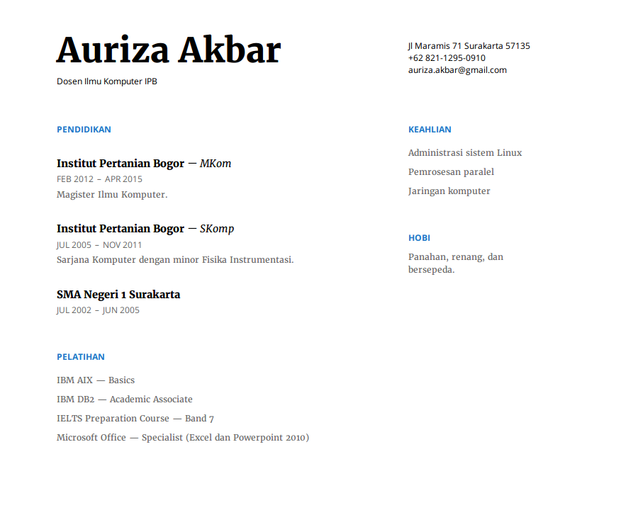

# Résumé styling

Lanjutkan tugas résumé pekan lalu dengan menambahkan CSS internal.
Buatlah semirip mungkin dengan contoh tampilan di bawah ini.
Kumpulkan dalam satu *file* dengan nama `[NIM].html`.

