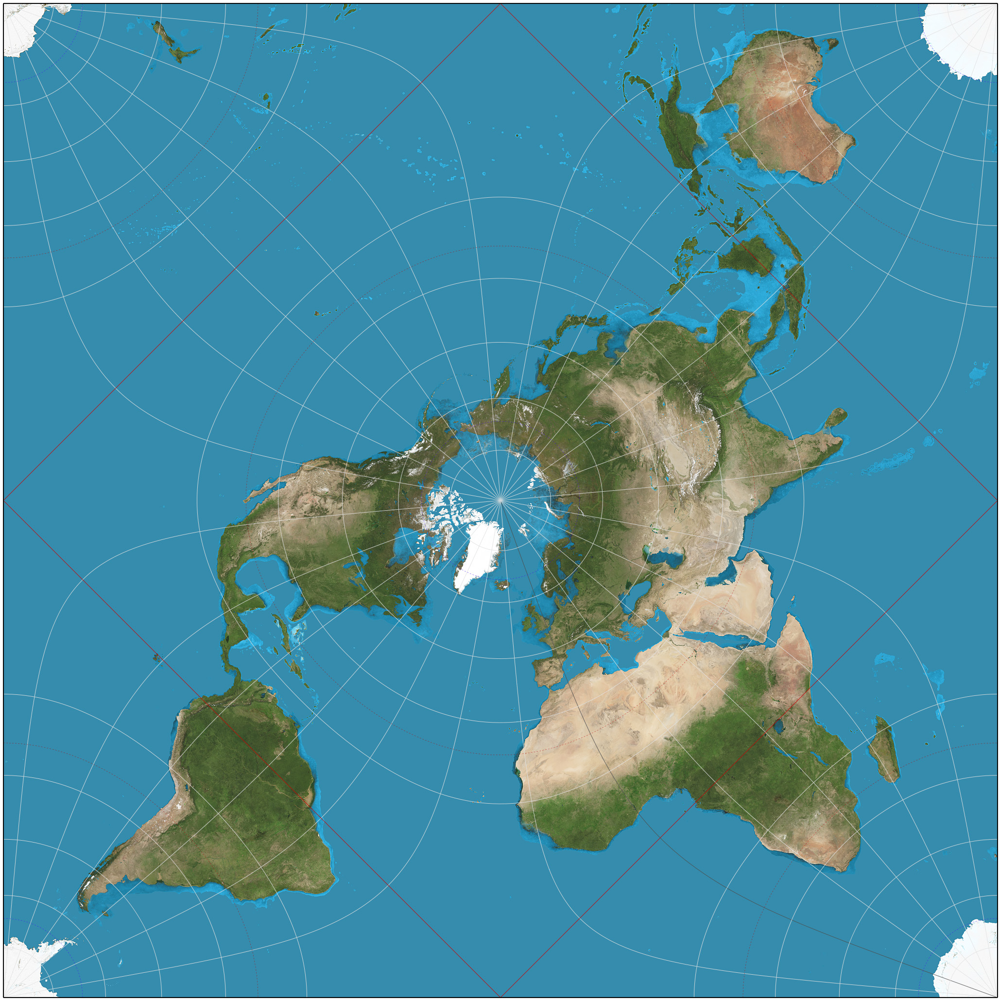

# Motivasi

## Mengapa Markdown?

- *no markup*
- mudah ditulis
- mudah dibaca
- teks biasa (.md)

## Populer

- GitHub
- StackOverflow
- WordPress
- Moodle (LMS)
- ...

# Sintaks

## Metadata[^yaml]

```yaml
---
title: Markdown
author: Auriza Akbar
institute: Ilmu Komputer IPB
date: 2017
theme: Dresden
header-includes:
- \renewcommand{\figurename}{Gambar}
- \renewcommand{\tablename}{Tabel}
---
```

[^yaml]: *lihat* <http://pandoc.org/MANUAL.html#variables-set-by-pandoc>

## Paragraf

```markdown
Sebuah paragraf.

Paragraf selanjutnya setelah satu baris kosong.
```


## Paragraf

`\[space]`
: *non-breaking space*

`\[newline]`
: *line-break*

`--`
: *en dash*, --

`---`
: *em dash*, ---

`...`
: *ellipsis*

```markdown
Harga emas saat ini sekitar Rp\ 550\ 000 per gram,
wajib dikeluarkan zakatnya jika sudah mencapai
*nishab* 85 gram dan *haul* setahun.
```

Zakat mal berlaku untuk ...
Harga emas saat ini sekitar Rp\ 550\ 000 per gram,
wajib dikeluarkan zakatnya jika sudah mencapai
*nishab* 85 gram dan *haul* setahun.


## Format Teks

`_emphasis_`
: _emphasis_

`**strong**`
: **strong emphasis**

`` `code` ``
: `code`

`~~strike~~`
: ~~strike~~

`^super^`
: ^super^script

`~sub~`
: ~sub~script


## Header

~~~markdown
# Header 1

## Header 2

### Header 3

#### Header 4

##### Header 5

###### Header 6
~~~


## Kutipan

```markdown
> There are six levels of knowledge:
>
> 1. excellence in asking questions,
> 2. excellence in paying attention and listening,
> 3. excellence in understanding, ...
```

> There are six levels of knowledge:
>
> 1. excellence in asking questions,
> 2. excellence in paying attention and listening,
> 3. excellence in understanding,
> 4. memorizing,
> 5. teaching, and
> 6. implementing it and appreciating its boundaries.


## Kode Program

````
```c
int main() {
    printf("Hello world!\n");
    return 0;
}
```
````

```c
int main() {
    printf("Hello world!\n");
    return 0;
}
```


## List

```markdown
- satu
- dua
- tiga
```

- satu
- dua
- tiga


## List Urutan

```markdown
1. satu
2. dua
3. tiga
```

1. satu
2. dua
3. tiga


## List Bersarang

```markdown
1. satu
    - indentasi
    - empat spasi
2. dua
3. tiga
```

1. satu
    - indentasi
    - empat spasi
2. dua
3. tiga


## List Definisi

```markdown
awkward
: causing difficulty; hard to do or deal with.

goggle
: look with wide open eyes.
```

awkward
: causing difficulty; hard to do or deal with.

goggle
: look with wide open eyes.


## Tautan

### Otomatis

```markdown
Kunjungi <http://cs.ipb.ac.id> atau email ke
<cs@ipb.ac.id>.
```

Kunjungi <http://cs.ipb.ac.id> atau email ke <cs@ipb.ac.id>.

## Tautan

### *Inline*

```markdown
Kunjungi [Ilkom IPB](http://cs.ipb.ac.id) atau
kirim [email](mailto:cs@ipb.ac.id).
```

### *Reference*

```markdown
Kunjungi [Ilkom IPB] atau kirim [email].

[ilkom ipb]: http://cs.ipb.ac.id
[email]: mailto:cs@ipb.ac.id

```

Kunjungi [Ilkom IPB] atau kirim [email].

[ilkom ipb]: http://cs.ipb.ac.id
[email]: mailto:cs@ipb.ac.id


## Catatan Kaki

```markdown
Dibimbing oleh Dr Heru Sukoco[^hrs] dan
Dr Sugi Guritman[^sgn].

[^hrs]: Departemen Ilmu Komputer IPB
[^sgn]: Departemen Matematika IPB

```

Dibimbing oleh Dr Heru Sukoco[^hrs] dan
Dr Sugi Guritman[^sgn].

[^hrs]: Departemen Ilmu Komputer IPB
[^sgn]: Departemen Matematika IPB


## Gambar

~~~markdown
Proyeksi persegi untuk peta dunia dapat dilihat
pada Gambar \ref{fig.map}.

{#fig.map width=50%}
~~~

## Gambar

Proyeksi persegi untuk peta dunia dapat dilihat
pada Gambar \ref{fig.map}.

{#fig.map width=50%}


## Tabel

~~~markdown
Table: Nilai Penkom.

 NIM  Nama       Nilai
----- --------- ------
 001  Hanif         70
 002  Sarah         80
 003  Ahmad        100
~~~

Table: Nilai Penkom.

 NIM  Nama       Nilai
----- --------- ------
 001  Hanif         70
 002  Sarah         80
 003  Ahmad        100


## Persamaan Matematika

~~~markdown
Untuk menulis persamaan, sama dengan LaTeX. Misal
persamaan *inline* $x^2 + y^2 = 0$, atau persamaan
*displayed*:

$$ \sum_{i=0}^n A_i $$
~~~

Untuk menulis persamaan, sama dengan LaTeX. Misal
persamaan *inline* $x^2 + y^2 = 0$, atau persamaan
*displayed*:

$$\sum_{i=0}^n A_i$$


## Persamaan Matematika

~~~markdown
Untuk persamaan bernomor, langsung dengan sintaks
LaTeX:

\begin{equation}
    \sum_{i=0}^n A_i
\end{equation}
~~~

Untuk persamaan bernomor, langsung dengan sintaks
LaTeX:

\begin{equation}
    \sum_{i=0}^n A_i
\end{equation}


## Lain-lain

Untuk sintaks yang tidak disediakan Markdown, bisa langsung menggunakan
sintaks LaTeX atau HTML.

~~~latex
\textsc{Auriza Akbar}
~~~

\textsc{Auriza Akbar}

~~~html
<span style="font-variant:small-caps">Auriza Akbar</span>
~~~

<span style="font-variant:small-caps">Auriza Akbar</span>


# Kompilasi

## Pandoc

- konversi Markdown ke:
    - HTML
    - LaTeX, PDF
    - EPUB
    - ODT, docx
    - man page
- berbasis *command line*[^man]

[^man]: *lihat* manualnya di <http://pandoc.org/README.html>


## Instalasi Pandoc[^note]

Windows
:   <https://github.com/jgm/pandoc/releases>

Linux
:   `apt install pandoc`

*Online*
:   <https://pandoc.org/try/>

[^note]: instal LaTeX dahulu agar bisa konversi ke PDF

## Opsi Penting

`-o`
: *output file* ...

`-t`
: *to format* ...

`-F`
: *filter program* ...

### HTML

`-s`
: *standalone*

`-S`
: *smart punctuation*

`-c`
: *CSS file* ...

`--mathjax`
: render persamaan dengan MathJax

<!--
`--self-contained`
: satukan semua *style* dan *script* ke *file* HTML
-->

## Konversi Dokumen

### PDF

~~~bash
pandoc text.md -o text.pdf
~~~

### HTML

~~~bash
pandoc text.md -o text.html -sS
~~~


## Konversi Slide

### PDF (Beamer)

~~~bash
pandoc slide.md -o slide.pdf -t beamer
~~~

### HTML (Slidy, Reveal.js[^reveal])

~~~bash
pandoc slide.md -o slide.html -sSt slidy

pandoc slide.md -o slide.html -sSt revealjs
~~~

[^reveal]: unduh [Reveal.js](https://github.com/hakimel/reveal.js/archive/master.zip)
    dan ekstrak ke direktori yang sama


# Slide

## Aturan

`#`
: *slide* judul

`##`
: *slide* baru

`---`
: *slide* baru tanpa judul

`. . .`
: *pause*


## List Inkremental

```markdown
> - satu
> - dua
> - tiga
```

> - satu
> - dua
> - tiga

## Tema

Tambahkan metadata `theme:`{.yaml} untuk mengatur tema *slide*.

### Beamer

Antibes Bergen Berkeley Berlin Boadilla CambridgeUS Darmstadt Dresden Frankfurt
Goettingen Hannover Ilmenau JuanLesPins Madrid Montpellier PaloAlto Pittsburgh
Rochester Singapore Szeged

### Reveal.js

beige black blood league moon night serif simple sky solarized white

# FIN
