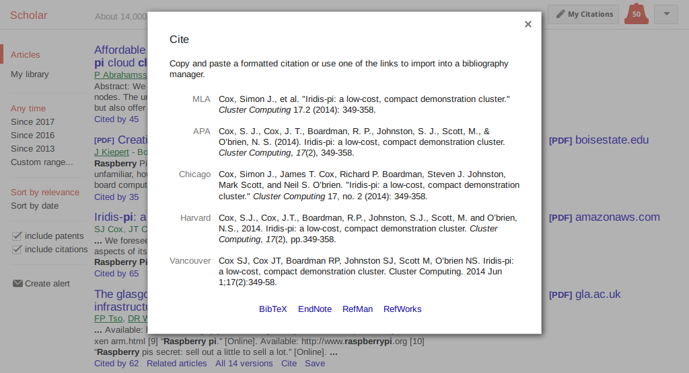

# Bibliografi

## Amanah Ilmiah

- karya harus hasil kerja sendiri
- jika tidak, sertakan sumbernya

## Bibliografi

- daftar sumber rujukan
- teks biasa (.bib)

## Jenis Pustaka

- `@article`: artikel jurnal, majalah, atau koran
- `@book`: buku dengan penerbit
- `@inproceedings`: prosiding konferensi
- `@mastersthesis`: tesis
- `@misc`: sumber lain


## Jurnal
```bib
@article{label,
    author    = "",
    year      = "",
    title     = "",
    journal   = "",
    %volume   = "",
    %number   = "",
    %pages    = "",
    %month    = "",
    %note     = ""
}
```

## Contoh Jurnal

```bib
@article{greenwade93,
    author    = "George D. Greenwade",
    title     = "The {C}omprehensive {TeX} {A}rchive
                 {N}etwork ({CTAN})",
    year      = "1993",
    journal   = "TUGBoat",
    volume    = "14",
    number    = "3",
    pages     = "342--351"
}
```

## Buku
```bib
@book{label,
    author    = "",
    year      = "",
    title     = "",
    publisher = "",
    %volume   = "",
    %number   = "",
    %series   = "",
    %address  = "",
    %edition  = "",
    %month    = "",
    %note     = ""
}
```

## Contoh Buku

```bib
@book{goossens93,
    author    = "Michel Goossens and Frank Mittelbach
                 and Alexander Samarin",
    title     = "The {LaTeX} Companion",
    year      = "1993",
    publisher = "Addison-Wesley",
    address   = "Reading (US-MA)"
}
```

## Prosiding
```bib
@inproceedings{label,
    author    = "",
    year      = "",
    title     = "",
    booktitle = "",
    %editor   = "",
    %volume   = "",
    %number   = "",
    %series   = "",
    %pages    = "",
    %address  = "",
    %month    = "",
    %publisher= "",
    %note     = ""
}
```

## Tesis
```bib
@mastersthesis{label,
    author    = "",
    year      = "",
    title     = "",
    school    = "",
    %type     = "",
    %address  = "",
    %month    = "",
    %note     = ""
}
```

## *Miscellaneous*
```bib
@misc{label,
    %author   = "",
    %year     = "",
    %title    = "",
    %howpublished = "",
    %month    = "",
    %note     = ""
}
```

## Contoh Halaman Web

```bib
@misc{wikibooks-latex,
    author      = "Wikibooks",
    title       = "{LaTeX}",
    year        = "2016",
    howpublished= "\url{http://wikibooks.org/wiki/LaTeX}",
    note        = "Accessed: 2017-06-14"
}
```

---

Bibliografi format BibTeX bisa diunduh dari berbagai sumber.

{width=90%}

## Kompilasi

Gunakan metadata `bibliography:`{.yaml} untuk menambahkan *file* .bib.

```yaml
---
bibliography: ref.bib
---
```

Lalu, tambahkan opsi berikut pada `pandoc` untuk memproses sitasi.

```bash
pandoc ... -F pandoc-citeproc
```


# Sitasi

## Sitasi dalam Teks

```markdown
@goossens93 menulis buku yang bagus tentang LaTeX.
Untuk paket TeX, terdapat pada CTAN [@greenwade93].
Selain itu banyak sumber *online*, salah satunya
dari @wikibooks-latex.
```

@goossens93 menulis buku yang bagus tentang LaTeX.
Untuk paket TeX, terdapat pada CTAN [@greenwade93].
Selain itu banyak sumber *online*, salah satunya
dari @wikibooks-latex.

## Gaya Sitasi

- Nama-tahun (Harvard)
    - APA
    - CSE^[Council of Science Editors]
- Nomor (Vancouver)
    - ACM
    - IEEE

@ppki3e mengikuti gaya sitasi nama-tahun dari CSE.

## Mengatur Gaya Sitasi

Gunakan metadata `csl:`{.yaml} untuk menambahkan *file* CSL[^csl].
Untuk gaya sitasi IPB, gunakan *file* `ipb.csl`[^ipbcsl].

```yaml
---
csl: ipb.csl
---
```

[^ipbcsl]: <https://gist.github.com/auriza/4b43aaf3d3ef3128aaa0aea990ab0628>
[^csl]: <https://github.com/citation-style-language/styles>


# Singkatan

## Singkatan

Biasanya nama jurnal dan prosiding disingkat untuk meringkas penulisan daftar pustaka.

Gunakan metadata `citation-abbreviations:`{.yaml} untuk menambahkan *file* yang
berisi daftar singkatan.

```yaml
---
citation-abbreviations: abbr.json
---
```

## Contoh

Berikut contoh isi *file* singkatan tersebut dalam format JSON.

```javascript
{
  "default": {
    "container-title": {
      "Journal of Intelligent...": "J Intell Robot Syst",
      "Procedia Computer Science": "Procedia Comput Sci",
      "International Conferen...": "Int Conf Syst Sci Eng"
    },
    "publisher": {
      "IPB Press": "IPB Pr"
    }
  }
}
```

# FIN

## Referensi

\footnotesize
